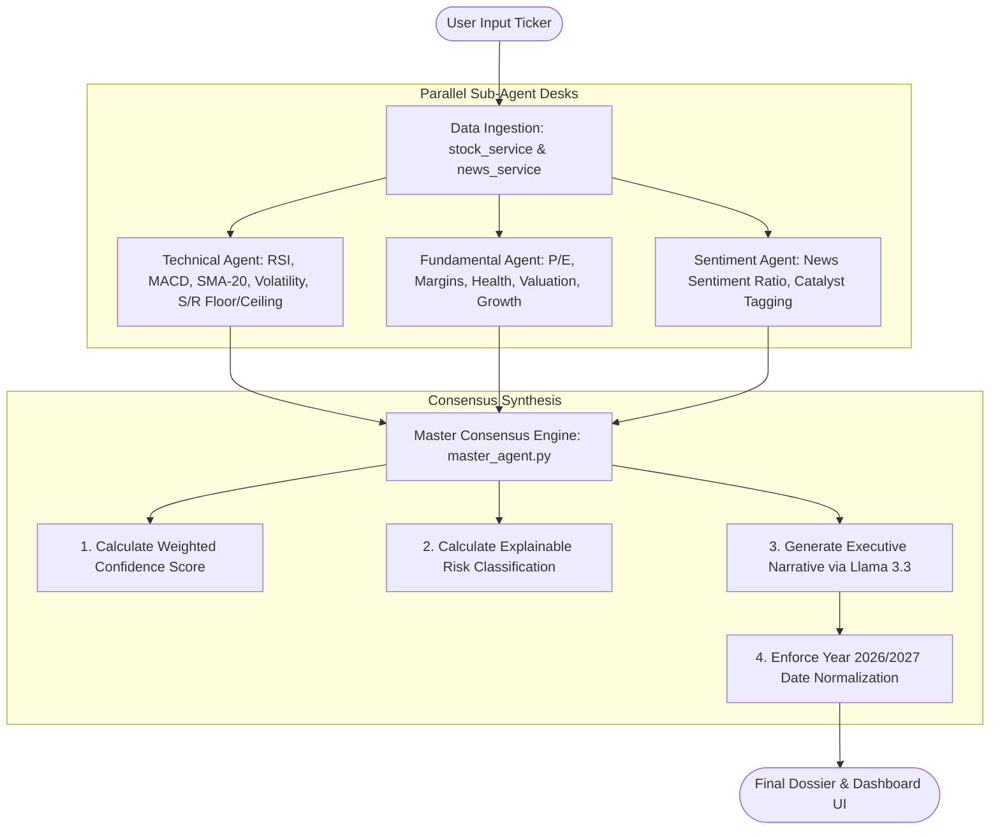

# 🔄 Multi-Agent Consensus Flow: Quantum Agent

This document explains the technical details of the sub-agent calculations, multi-timeframe trend checks, date normalization, and Master Agent consensus weighting inside the **QUANTUM** platform.

---

## 📈 Pipeline Sequence

The pipeline orchestrates synchronous data collection, parallel analytical evaluations, and consensus synthesis. The process flow is illustrated below:

---

## 🎛️ Sub-Agent Analysis Logic

Each specialized agent conducts mathematical evaluations on the ingested data before prompting the reasoning model or falling back to rules.

### 1. Technical Analysis Agent
* **Core Indicators**: Computes Relative Strength Index (RSI-14), MACD Oscillator, and moving averages (50-day and 200-day Simple Moving Averages).
* **Support & Resistance**: Evaluates a 20-day local price minimum as the **Support Floor** and a 20-day local maximum as the **Resistance Ceiling**.
* **Multi-Timeframe Trend Structure**: Iterates through `15m`, `1h`, `4h`, `1d`, and `1w` price series, checking the relationship between current price and the 20-period SMA (SMA-20):
  * **Bullish**: Price is above SMA-20. Returns **Strong Bullish** if the SMA-20 slope is positive and price is $> 1.02 \times$ SMA-20.
  * **Bearish**: Price is below SMA-20. Returns **Strong Bearish** if the SMA-20 slope is negative and price is $< 0.98 \times$ SMA-20.
  * **Neutral**: Price is range-bound within $2\%$ of SMA-20.
* **LLM Synthesis**: Submits the structured indicators and timeframes to the LLM to write a comprehensive technical summary, trigger signals, and technical risk factors.

### 2. Fundamental Analysis Agent
* **Core Metrics**: Examines price-to-earnings (P/E) ratio, YoY revenue expansion, YoY net profit growth, net profit margins, cash/debt buffers, and market capitalization scale.
* **Score Matrices**: Calculates index scores (0–100) for:
  * **Financial Health**: Balance sheet solvency and cash/debt ratios.
  * **Valuation Safety**: Multiples compared to historical ranges.
  * **Growth Momentum**: Top and bottom line growth sustainability.
* **LLM Synthesis**: Submits the financial metrics to the LLM to identify solvency strengths, business vulnerabilities, and growth outlook comments.

### 3. Sentiment Analysis Agent
* **RSS XML Harvester Fallback**: Harvests articles from Yahoo Finance. If blocked or empty, queries Google News search RSS XML fallback directly.
* **Heuristic Sentiment Score**: Scans headlines for positive and negative keywords, categorizing each article's sentiment.
* **Consensus Ratios**: Computes:
  $$\text{Positive Ratio} = \frac{\text{Positive Articles}}{\text{Total Articles}}$$
  $$\text{Negative Ratio} = \frac{\text{Negative Articles}}{\text{Total Articles}}$$
* **LLM Synthesis**: Prompts the LLM to summarize the general media narrative, tag corporate events (Earnings, Product Launches, Regulatory shifts), and compile primary bullish vs bearish media drivers.

---

## ⚖️ Master Agent Consensus & Normalization

The Master Agent acts as the final aggregator, combining sub-agent outputs and cleaning LLM responses.

### 1. Weighted Confidence Calculation
To prevent LLM confidence score drift or inflation, the platform calculates overall confidence mathematically in Python prior to LLM generation:
$$\text{Master Confidence} = (C_{\text{tech}} \times 0.40) + (C_{\text{fund}} \times 0.35) + (C_{\text{sent}} \times 0.25)$$

### 2. Explainable Risk Calculation
The platform assesses risk using a Python-controlled multi-factor formula:
$$\text{Risk Score} = \text{Disagreement Risk} + \text{Volatility Risk} + \text{News Uncertainty}$$
* **Disagreement Risk (Max 70 points)**: Maps sub-agent sentiments (Bullish = +1, Bearish = -1, Neutral = 0) and computes the range:
  $$\text{Disagreement Risk} = (\max(\text{signals}) - \min(\text{signals})) \times 35$$
* **Volatility Risk (Max 20 points)**: Volatility $\ge 35\%$: +20 points; Volatility $\ge 20\%$: +10 points.
* **News Uncertainty (Max 10 points)**: Positive Ratio between $0.4$ and $0.6$: +10 points.

> [!NOTE]
> **Risk Mapping**: Risk Score $\ge 65$ is classified as **High**; $\ge 35$ is **Medium**; else **Low**.

### 3. Date Normalization & Alignment
To prevent LLMs from generating upcoming events with outdated years (such as 2024 or 2025 due to their pre-training cutoff bias), the backend enforces a post-processing normalizer:
* The `catalyst_calendar` expected dates are parsed.

