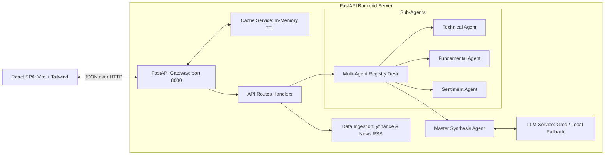

# 🏛️ System Architecture: Quantum Agent

This document explains the technical architecture, modular design, data structures, and resiliency strategies of the **QUANTUM** financial research platform.

---

## 🏛️ Topography & decoupling

The platform follows a clean client-server architecture. The user interface acts as an interactive terminal, communicating with a backend services pipeline:

---

## 🔌 Decoupled Components

### 1. Frontend: React Terminal Interface
- **Interactive UI**: Custom styling built with HSL color tokens, glassmorphic card overlays, status monitors, and progress timelines.
- **Embedded Charting**: Integrates the lightweight TradingView Widget to render financial charts without loading heavy tracking libraries.
- **Visual Gauges**: Renders SVGs and chart paths (using Recharts) to display RSI dials, confidence levels, and sentiment distributions.

### 2. Backend Gateway: FastAPI Server
- **FastAPI Core**: Lightweight REST gateway handling request formatting, validation rules, CORS, routing, and rate limits.
- **Fast and Asynchronous**: Asynchronous endpoint handlers allow concurrent stock analysis queries without blocking.

---

## 🧠 Core Ingestion & Analysis Pipelines

When a client queries a ticker:

1. **Exchange Ticker Resolution**: Capitalizes the input and resolves NSE symbols (e.g. `INFY` is resolved to `INFY.NS`) to maintain yfinance compatibility.
2. **In-Memory Cache Check**: Queries the cache service first. If present and within TTL, returns the cached result immediately ($<10\text{ms}$).
3. **Historical Data Harvest**: Ingests statistics, financials, and daily OHLCV values for multiple timeframes (`15m`, `1h`, `4h`, `1d`, `1w`).
4. **RSS XML Fallback**: Harvests articles from Yahoo Finance news. If empty, uses Google News search RSS XML fallback directly.
5. **Parallel Agent Execution**: Spawns Technical, Fundamental, and Sentiment agents to process variables in parallel.
6. **Consensus & Synthesis**: Synthesizes the results through `master_agent.py`. It computes weighted average confidence and mathematical risk parameters, then runs Groq LLM completions to produce executive narrative intelligence.

---

## 💾 Caching Strategy
* **Implementation**: Thread-safe in-memory Python dictionary cache with validation timestamps.
* **TTL Policy**: Expired entries (older than `300` seconds / 5 minutes) are cleared on lookup.
* **Benefits**: Prevents Yahoo Finance rate-limiting during high traffic, reduces Groq API usage, and returns results under $10\text{ms}$ for repeat queries.

---

## 🛡️ LLM Fallback Engineering
To ensure system availability under API key limits or connection failures, the platform implements an **automatic rule-based local fallback**:
- When `GROQ_API_KEY` is missing, rate-limited (HTTP 429), or times out (10.0s threshold), the LLM connector raises an exception.
- The calling agent catches the exception, logs it, and falls back to a local rules engine.
- This local rules engine populates all schema-compliant outputs with deterministic, mathematical fallbacks so the frontend never crashes.
