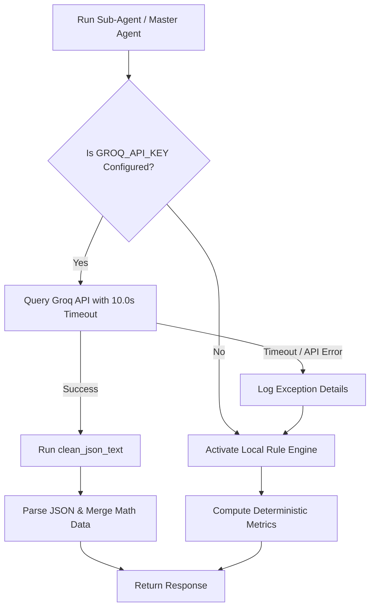

# 🤖 Groq LLM Integration & Fallback Architecture

This document explains the integration parameters, prompt interfaces, JSON cleaning utilities, and error fallback systems used to interface with the LLM.

---

## 🤖 Reasoning Model: llama-3.3-70b-versatile

The platform leverages **llama-3.3-70b-versatile** on the **Groq API** gateway to run multi-agent syntheses. This model provides rapid inference times, broad financial reasoning capabilities, and support for structured JSON outputs.

---

## 🛰️ Integration Details & Parameters

The platform communicates with Groq via direct HTTP POST requests using the synchronous `httpx.Client` handler.

### ⚙️ Core Parameters
* **Endpoint**: `https://api.groq.com/openai/v1/chat/completions`
* **JSON Mode**: Enforced via `response_format={"type": "json_object"}` inside the API payload.
* **Temperature**: Fixed at `0.1` to ensure analytical consistency, reproducibility, and prevent speculative summaries.
* **Strict Timeout Limit**: Capped at **10.0 seconds** per call with **2 retry attempts** using linear backoffs. This stops the React client from freezing due to network latency.

---

## 🧹 Response Cleaning Wrapper (`clean_json_text`)

LLMs sometimes wrap JSON outputs in Markdown code blocks (e.g. ```json ... ```) even when JSON Mode is requested.
To handle this, the `llm_service.py` utility runs responses through `clean_json_text`:

```python
import re

def clean_json_text(text: str) -> str:
    """Strips markdown code blocks and extracts JSON object from LLM response."""
    if not text:
        return text
    text = text.strip()
    # Strip markdown backticks
    text = re.sub(r"^```(?:json)?\s*", "", text, flags=re.IGNORECASE)
    text = re.sub(r"\s*```$", "", text)
    # Match outermost curly braces to extract raw JSON
    match = re.search(r"(\{.*\})", text, re.DOTALL)
    if match:
        return match.group(1)
    return text
```

This guarantees valid, parseable JSON payloads prior to dictionary translation and schema validation.

---

## 🛡️ Robust Fallback Architecture

If the Groq API fails (due to invalid API key, network timeout, rate limit HTTP 429, or JSON parsing anomalies), the system executes a **local heuristic rules fallback** to ensure high availability.



### Fallback Content Generators:
* **Technical Agent Fallback**: Returns trends based on SMA-20 slopes, support/resistance lines, and RSI indices calculated in Python.
* **Fundamental Agent Fallback**: Generates comments and health metrics based on hardcoded PE ratios, revenue growth rates, and cash reserves.
* **Sentiment Agent Fallback**: Populates news sentiment summaries and event tags by checking titles against keyword lists.
* **Master Agent Fallback**: Computes consensus statistics in Python and returns a standard summary, ensuring consistent performance.
